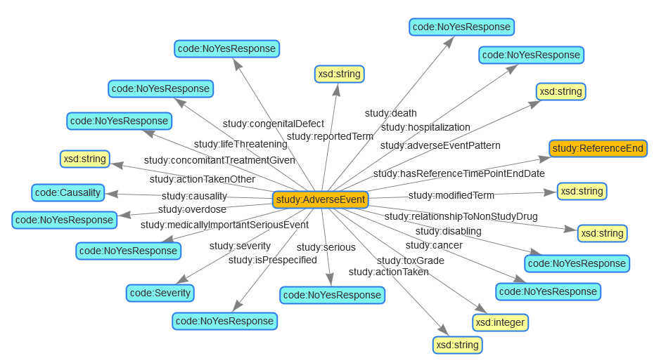

## Revision

Date         | Comment
------------ | ----------------------------
2019-02-25   | Documentation creation (KG)


## Overview

Here we check the current Adverse Event Ontologies, how to investigate this and checkout the instanciation

## Prerequisites

If you want to run the provided SPARQL queries, you need to have the stardog database setup. Create a database called "CTDasRDFOWL" and include all required namespaces.

```
@prefix arg: <http://spinrdf.org/arg#> .
@prefix code: <https://w3id.org/phuse/code#> .
@prefix owl: <http://www.w3.org/2002/07/owl#> .
@prefix rdf: <http://www.w3.org/1999/02/22-rdf-syntax-ns#> .
@prefix rdfs: <http://www.w3.org/2000/01/rdf-schema#> .
@prefix sdtmterm: <https://w3id.org/phuse/sdtmterm#> .
@prefix sh: <http://www.w3.org/ns/shacl#> .
@prefix skos: <http://www.w3.org/2004/02/skos/core#> .
@prefix smf: <http://topbraid.org/sparqlmotionfunctions#> .
@prefix sp: <http://spinrdf.org/sp#> .
@prefix spin: <http://spinrdf.org/spin#> .
@prefix spl: <http://spinrdf.org/spl#> .
@prefix study: <https://w3id.org/phuse/study#> .
@prefix time: <http://www.w3.org/2006/time#> .
@prefix xsd: <http://www.w3.org/2001/XMLSchema#> .
```

Then load the study.ttl file into this database. On the web interface, select the database -> "<_Query" -> Data -> Add. If you made some issues or have old data loaded. You can execute the following query to delete all triples:

```
DELETE{?s ?p ?o} WHERE{?s ?p ?o}
```

Load the pilot content into another dabase called "CTDasRDFSMS" where you load the cdiscpilot01.ttl file.

Additionally looking into the files directly via an editor program like notepad or ultraedit should be done to follow up.

## Checkout Ontology for AdverseEvents

### Direct Connections

The study:AdverseEvent item in the study.ttl described the ontology for Adverse events. There are direct domain-range triples related to this object which can be investigated with the following query:

```
SELECT ?domain ?predicate ?range 
WHERE {
      {BIND(study:AdverseEvent as ?domain)
       ?predicate  rdfs:domain ?domain .
       ?predicate rdfs:range ?range .
      }UNION
      {BIND(study:AdverseEvent as ?range)
       ?predicate  rdfs:domain ?domain .
       ?predicate rdfs:range ?range .
      }
	}
```

We have two separte parts, the first parts checks where the "study:AdverveEvent" is the DOMAIN and the second part checks where it is the RANGE. When looking into the result, it seems the "study:AdverveEvent" only appears as DOMAIN, so only has outgoing attributes.



### Indirect Connections through subClass

Apart from the direct connections, there are additional indirect properties attached which comes through inheritance. SubClass of connections can be investiaged with the following SPARQL for "study:AdverseEvent":

```
SELECT DISTINCT *
	WHERE { BIND(study:AdverseEvent AS ?item)
      		?item rdfs:subClassOf ?mother
            OPTIONAL {?child rdfs:subClassOf ?item}}
```

By exchanging the "item", the complete class hierarchy can be investigated. Alternativly the tool Protege or some other ontology tools can be used to investigate the hierarchy. Finally the following hierarchy is available:

- study:AdverseEvent
- study:MedicalCondition
- study:Event
- study:Entity
- study:StudyComponent

To investigate all potential links to and from "study:AdverveEvent", also the potential links for upper classes has to be considered as options for "study:AdverveEvent".


There is one incoming link which is the "study:Person" who is afflicted by a "study:MedicalCondition", so also by a "study:AdverseEvent". Important date, sequence and other required information links are available through the basis class "study:StudyComponent" where the "study:AdverseEvent" is also a child of.

### Further connections trough SHACL

Still the main information about the MedDRA code itself is currently still missing. When looking into the study.ttl file and study "study:AdverveEvent", there is some SHACL inside which is currently not covered. As these rules are no direct links and also not attached to a different place in the hierarchy, it has been missed so far. 

The SHACL connection can be retrieved trough the following SPARQL:

```
SELECT ?domain ?predicate ?range WHERE {
 	{?domain  sh:property ?temp .
     ?temp sh:path ?predicate .
     ?temp sh:class ?range
    }}
```


Inclusing these links as well all required Adverse Event information have a location where to go.

## Links available according the ontology

The following attributes are finally available according the current study.ttl ontology. The only "incoming" link to the study:AdverseEvent is coming from study:Person through the "study:afflictedBy" property. All other Attributes are more or less simpyl linked to the Adverse Event object.

Domain	|	Predicate	|	Range
_study:Person_**	|	_study:afflictedBy_**	|	_study:MedicalCondition_**
study:AdverseEvent	|	code:hasCode	|	<https://w3id.org/phuse/mdra#MedDRAConcept>
study:AdverseEvent	|	code:outcome	|	code:AdverseEventOutcome
study:AdverseEvent	|	study:actionTaken	|	xsd:string
study:AdverseEvent	|	study:actionTakenOther	|	xsd:string
study:AdverseEvent	|	study:adverseEventPattern	|	xsd:string
study:AdverseEvent	|	study:causality	|	code:Causality
study:AdverseEvent	|	study:causality	|	code:Causality
study:AdverseEvent	|	study:concomitantTreatmentGiven	|	code:NoYesResponse
study:AdverseEvent	|	study:congenitalDefect	|	code:NoYesResponse
study:StudyComponent	|	study:crfLocation	|	study:CRFLocation
study:StudyComponent	|	study:dataCollectionDay	|	xsd:integer
study:StudyComponent	|	study:day	|	xsd:integer
study:AdverseEvent	|	study:death	|	code:NoYesResponse
study:AdverseEvent	|	study:disabling	|	code:NoYesResponse
study:StudyComponent	|	study:endDay	|	xsd:integer
study:StudyComponent	|	study:groupID	|	xsd:string
study:StudyComponent	|	study:hasDate	|	time:Instant
study:StudyComponent	|	study:hasInterval	|	time:Interval
study:AdverseEvent	|	study:hasInterval	|	study:AdverseEventInterval
study:AdverseEvent	|	study:hasReferenceTimePointEndDate	|	study:ReferenceEnd
study:AdverseEvent	|	study:hospitalization	|	code:NoYesResponse
study:AdverseEvent	|	study:isPrespecified	|	code:NoYesResponse
study:AdverseEvent	|	study:lifeThreatening	|	code:NoYesResponse
study:AdverseEvent	|	study:medicallyImportantSeriousEvent	|	code:NoYesResponse
study:AdverseEvent	|	study:modifiedTerm	|	xsd:string
study:AdverseEvent	|	study:overdose	|	code:NoYesResponse
study:StudyComponent	|	study:referenceID	|	xsd:string
study:AdverseEvent	|	study:relationshipToNonStudyDrug	|	xsd:string
study:AdverseEvent	|	study:reportedTerm	|	xsd:string
study:StudyComponent	|	study:seq	|	xsd:float
study:AdverseEvent	|	study:serious	|	code:NoYesResponse
study:AdverseEvent	|	study:severity	|	code:Severity
study:AdverseEvent	|	study:severity	|	code:Severity
study:StudyComponent	|	study:sponsordefinedID	|	xsd:string
study:StudyComponent	|	study:startDay	|	xsd:integer
study:AdverseEvent	|	study:toxGrade	|	xsd:integer

